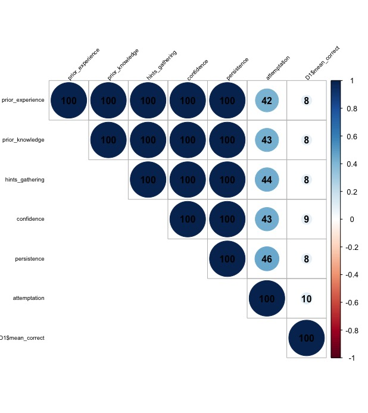
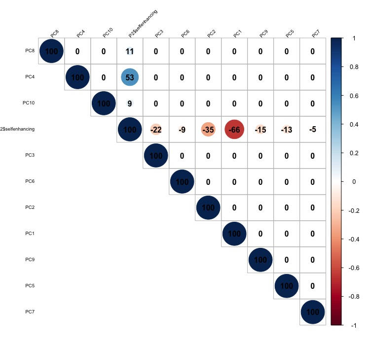

#Data
The data you will be using comes from teh Assistments online intelligent tutoring system (https://www.assistments.org/). It describes students working through online math problems. Each student has the following data associated with them:

- id
- prior_prob_count: How many problems a student has answered in the system prior to this session
- prior_percent_correct: The percentage of problems a student has answered correctly prior to this session
- problems_attempted: The number of problems the student has attempted in the current session
- mean_correct: The average number of correct answers a student made on their first attempt at problems in the current session
- mean_hint: The average number of hints a student asked for in the current session
- mean_attempt: The average number of attempts a student took to answer a problem in the current session
- mean_confidence: The average confidence each student has in their ability to answer the problems in the current session

#Start by uploading the data
```{r}
D1 <- read.table("Assistments-confidence.csv", sep = ",", header = TRUE)

D1 <- dplyr::select(D1, 2:8)

  #We won't need to id variable, so remove that.


```

#Create a correlation matrix of the relationships between the variables, including correlation coefficients for each pair of variables/features.

```{r}
#You can install the corrplot package to plot some pretty correlation matrices (sometimes called correlograms)

library(corrplot)

#Generate pairwise correlations
COR <- cor(D1)

corrplot(COR, order="AOE", method="circle", tl.pos="lt", type="upper",        
tl.col="black", tl.cex=0.6, tl.srt=45, 
        addCoef.col="black", addCoefasPercent = TRUE,
        sig.level=0.50, insig = "blank")

#Study your correlogram image and save it, you will need it later
```

#Create a new data frame with the mean_correct variables removed

```{r}
D2 <-  dplyr::select(D1, 1:3, 5:7)

#The, scale and center your data for easier interpretation
D2 <- scale(D2, center = TRUE)
```

#Now run the PCA on the new data frame

```{r}
pca <- prcomp(D2, scale = TRUE)
```

#Although the algorithm does not generate the eigenvalues directly for us, we can print a list of the standard deviation of the variance accounted for by each component.

```{r}
pca$sdev

#To convert this into variance accounted for we can square it, these numbers are proportional to the eigenvalue

pca$sdev^2

#A summary of our pca will give us the proportion of variance accounted for by each component

summary(pca)
#Importance of components:
#                          PC1    PC2    PC3    PC4    PC5     PC6
#Standard deviation     1.2825 1.0544 1.0246 0.9621 0.8557 0.73201
#Proportion of Variance 0.2741 0.1853 0.1750 0.1543 0.1220 0.08931
#Cumulative Proportion  0.2741 0.4594 0.6344 0.7887 0.9107 1.00000

#We can lot this to get an idea of which components we should keep and which we should drop

plot(pca, type = "lines")
```
image: 

#Think about which components you would drop and make a decision
(I would keep the upper left 2 components and drop the others because the combination of upper left 2 components explain the majority of variences. )
I understand that I was wrong with this. the slope becomes steeper after PC3. All 6PCs should be included for analyzed. 

```{r}
#Now, create a data frame of the transformed data from your pca.

D3 <- as.data.frame(pca$x)

#Attach the variable "mean_correct" from your original data frame to D3.

D4 <- cbind(D3, as.data.frame(D1$mean_correct))

#Now re-run your scatterplots and correlations between the transformed data and mean_correct. If you had dropped some components would you have lost important infomation about mean_correct?

COR2 <- cor(D4)
corrplot(COR2, order="AOE", method="circle", tl.pos="lt", type="upper",        
         tl.col="black", tl.cex=0.6, tl.srt=45, 
         addCoef.col="black", addCoefasPercent = TRUE,
         sig.level=0.50, insig = "blank")
  
```
image: 

(if we drop some components, we would not lose important information. The components with larger eigenvalues contrain the scale and trends information of original data.) After reading Prof.Lang's feedbacks towards the classmates submissions, I understand that I was wrong again. If we drop PC5&6, we will lose a big piece of information representing -0.39 (PC6) of mean_correct.

#Now print out the eigenvectors (often called loadings) for the components you generated:

```{r}
pca$rotation

#Examine the eigenvectors, notice that they are a little difficult to interpret. It is much easier to make sense of them if we make them proportional within each component

loadings <- abs(pca$rotation) #abs() will make all eigenvectors positive

loadings2 <- sweep(loadings, 2, colSums(loadings), "/") #sweep() computes each row as a proportion of the column. (There must be a way to do this with dplyr()? * group_by () %>% summarise (n=n()) %>% mutate (rel.freq = n / total)*)
loadings3 <- t(loadings2)
```
#Now examine your components and try to come up with substantive descriptions of what some might represent?

(From the loadings, we could see component 1 represents 0.63 of meanhint, 0.45 of problem attempts; component 2 represent 0.81 of prior percent correct, 0.45 of prior problem count etc.) 
I was over simplified the explaination of this problem, causing the confusing of problem-solving for next question.
From the loadings, we could see PC1 represents a combination of attemptations and hints gathering, interpreted as persistence (reference@lfaf373, thanks for sharing); PC2 represents 0.81 of prior percent correct, interpreted as prior knowledge; PC3 represents confidence; PC4 represents prior experience; PC5 represents attemptation; PC6 represents hints gathering. 

#You can generate a biplot to help you, though these can be a bit confusing. They plot the transformed data by the first two components. Therefore, the axes represent the direction of maximum variance. Then mapped onto this point cloud are the original directions of the variables, depicted as red arrows. It is supposed to provide a visualization of which variables "go together". Variables that possibly represent the same underlying construct point in the same direction.  
```{r}
biplot(pca)
```

#Calculate values for each student that represent these your composite variables and then create a new correlogram showing their relationship to mean_correct.

```{r}

persistence <- 0.124231133802369*D2$prior_prob_count+0.0803595580597633*D2$prior_percent_correct+0.217447373356448*D2$problems_attempted+0.302237796251017*D2$mean_hint+0.258634577853408*D2$mean_attempt+0.0170895606769939*D2$mean_confidence
prior_knowledge <- 0.250811862373885*D2$prior_prob_count + 0.446776211920339*D2$prior_percent_correct+0.173444694422021*D2$problems_attempted+0.0684338702175256*D2$mean_hint+0.046588440440991*D2$mean_attempt+0.0139449206252386*D2$mean_confidence
confidence <- 0.221017004387105*D2$prior_prob_count+0.0510899830782748*D2$prior_percent_correct+0.200602878158414*D2$problems_attempted+0.0441521668541959*D2$mean_hint+0.0252787785501249*D2$mean_attempt+0.457859188971885*D2$mean_confidence
prior_experience <- 0.315162570310492*D2$prior_prob_count + 0.120626986454428*D2$prior_percent_correct + 0.144756640556877*D2$problems_attempted + 0.0512924612431948*D2$mean_hint + 0.142039865428019*D2$mean_attempt + 0.226121476006989*D2$mean_confidence
attemptation <- 0.00366446772476213*D2$prior_prob_count+0.15331501423353*D2$prior_percent_correct+0.303884750456673*D2$problems_attempted+0.0524837639560854*D2$mean_hint+0.357699023479297*D2$mean_attempt+0.128952980149652*D2$mean_confidence
hints_gathering <- 0.140116512821902*D2$prior_prob_count + 0.177701543338857*D2$prior_percent_correct + 0.157489829816897*D2$problems_attempted + 0.356088362436716*D2$mean_hint + 0.161654781654518*D2$mean_attempt+0.00694896993111117*D2$mean_confidence

D5 <- cbind(persistence,prior_knowledge,confidence,prior_experience,attemptation,hints_gathering, as.data.frame(D1$mean_correct))
COR3 <- cor(D5)
corrplot(COR3, order="AOE", method="circle", tl.pos="lt", type="upper",        
         tl.col="black", tl.cex=0.6, tl.srt=45, 
         addCoef.col="black", addCoefasPercent = TRUE,
         sig.level=0.50, insig = "blank")
```
image: 
mean_correct decreases in correlation with newly generated factors. 

#Also in this repository is a data set and codebook from Rod Martin, Patricia Puhlik-Doris, Gwen Larsen, Jeanette Gray, Kelly Weir at the University of Western Ontario about people's sense of humor. Can you perform a PCA on this data?

```{r}
P1 <- read.table("humor_data.csv", sep = ",", header = TRUE)
# eliminate those data with (-1 = did not select an answer)
P2 = dplyr::filter(P1, Q1!= -1, Q2!= -1,Q3!= -1,Q4!= -1,Q5!= -1,Q6!= -1,Q7!= -1,Q8!= -1,Q9!= -1,Q10!= -1,Q11!= -1,Q12!= -1,Q13!= -1,Q14!= -1,Q15!= -1,Q16!= -1,Q17!= -1,Q18!= -1,Q19!= -1,Q20!= -1,Q21!= -1,Q22!= -1,Q23!= -1,Q24!= -1,Q25!= -1,Q26!= -1,Q27!= -1,Q28!= -1,Q29!= -1,Q30!= -1, Q31!= -1,Q32!= -1)
P2 = dplyr::filter(P2, age < 110)
P2 = dplyr::filter(P2, gender != 0)
P2 = dplyr::filter(P2, selfenhancing != 1)
#this person filing all the questions with 1, not a valid response.

P2 = dplyr::filter(P2, agressive != 5)
#this person filing all the questions with 5 4 5 4 5 4 pattern, not a valid response.

outlier(P2, opposite = FALSE, logical = FALSE)
#  Q1            Q2            Q3            Q4            Q5            Q6            Q7            Q8 
# 5.0           1.0           1.0           5.0           1.0           1.0           1.0           5.0 
#           Q9           Q10           Q11           Q12           Q13           Q14           Q15           Q16 
#          5.0           5.0           5.0           5.0           1.0           1.0           1.0           1.0 
#          Q17           Q18           Q19           Q20           Q21           Q22           Q23           Q24 
#          5.0           5.0           1.0           5.0           1.0           1.0           5.0           5.0 
#          Q25           Q26           Q27           Q28           Q29           Q30           Q31           Q32 
#          5.0           1.0           5.0           1.0           5.0           1.0           5.0           5.0 
#  affiliative selfenhancing     agressive selfdefeating           age        gender      accuracy 
#          1.3           1.3           4.8           5.0          70.0           3.0           7.0 
#it is ok to have Q1-32 from 1-5, age under 100, gender 1-3
P2 = dplyr::filter(P2, affiliative != 1.3)
P2 = dplyr::filter(P2, selfenhancing != 1.3)
P2 = dplyr::filter(P2, agressive != 4.8)
P2 = dplyr::filter(P2, selfdefeating != 5)
P2 = dplyr::filter(P2, accuracy != 7)

outlier(P2, opposite = FALSE, logical = FALSE)

#  affiliative selfenhancing     agressive selfdefeating           age        gender      accuracy 
#          1.4           1.5           1.6           1.0          70.0           3.0           9.0 
P2 = dplyr::filter(P2, affiliative != 1.4)
P2 = dplyr::filter(P2, selfenhancing != 1.5)
P2 = dplyr::filter(P2, agressive != 1.6)
P2 = dplyr::filter(P2, selfdefeating != 1)
P2 = dplyr::filter(P2, accuracy != 9)
outlier(P2, opposite = FALSE, logical = FALSE)
#  affiliative selfenhancing     agressive selfdefeating           age        gender      accuracy 
#          1.5           1.6           1.8           4.5          70.0           3.0          10.0 
P2 = dplyr::filter(P2, affiliative != 1.5)
P2 = dplyr::filter(P2, selfenhancing != 1.6)
P2 = dplyr::filter(P2, agressive != 1.8)
P2 = dplyr::filter(P2, selfdefeating != 4.5)
P2 = dplyr::filter(P2, accuracy != 10)
outlier(P2, opposite = FALSE, logical = FALSE)
#affiliative selfenhancing     agressive selfdefeating           age        gender      accuracy 
#     1.8           1.8           1.9           1.1          70.0           3.0          35.0 
P3 <- dplyr::select(P2, 1:32)
COR6 <- cor(P3)
corrplot(COR6, order="AOE", method="circle", tl.pos="lt", type="upper",        
         tl.col="black", tl.cex=0.6, tl.srt=45, 
         addCoef.col="black", addCoefasPercent = TRUE,
         sig.level=0.50, insig = "blank")
```

image: 
There are some questions are correlated with each others, forming a heatmap-like pattern in the correlation graph.
```{r}
pca3 <- prcomp(P3, scale = TRUE)
pca3$sdev
pca3$sdev^2
summary(pca3)
#Importance of components:
#                         PC1    PC2     PC3    PC4     PC5     PC6     PC7     PC8     PC9    PC10    PC11    PC12    PC13   PC14    PC15    PC16    PC17    PC18    PC19    PC20    PC21
#Standard deviation     2.555 1.8357 1.67338 1.5020 1.09526 1.02996 1.01837 0.96247 0.90843 0.88849 0.87855 0.84950 0.83086 0.8138 0.79011 0.78195 0.76069 0.74530 0.73738 0.72834 0.71128
#Proportion of Variance 0.204 0.1053 0.08751 0.0705 0.03749 0.03315 0.03241 0.02895 0.02579 0.02467 0.02412 0.02255 0.02157 0.0207 0.01951 0.01911 0.01808 0.01736 0.01699 0.01658 0.01581
#Cumulative Proportion  0.204 0.3093 0.39677 0.4673 0.50476 0.53791 0.57032 0.59927 0.62506 0.64973 0.67385 0.69640 0.71797 0.7387 0.75818 0.77728 0.79537 0.81273 0.82972 0.84630 0.86211
plot(pca3, type = "lines")
```

image: 
#these 10 PCs explain 65% of variences. we could drop the other components.
```{r}
pca3$rotation
loadings4 <- abs(pca3$rotation)
loadings5 <- sweep(loadings4, 2, colSums(loadings3), "/") 
loadings6 <- t(loadings5)
write.csv(loadings6, file = "loadings6.csv", row.names = FALSE)

#top 3 questions in each PC, reading from loading5
#PC1 represents spontaneous humor: Q17 tell jokes  Q5 naturally humorous person Q14 humor keeps me from getting depressed
#PC2 represents put myself down for fun: Q20 go overboard-put myself down Q8 get carried away-put myself down Q4 let people laugh at me
#PC3 represents not offended: Q31 not laugh to offend Q15 not use humor as a way of criticizing Q7 no others hurt by my humor
#PC4 represents positive thinking: Q18 cheer myself up Q10 make myself feel better Q17 do not like to tell jokes(unmatched)
#PC5 represents self-entertainment:  Q6 amused by the absurdities of life Q30 laugh by myself Q22 sad->lose humor(unmatched) 
#PC6 represents non-openness: Q28 cover problem up by joking Q22 sad->lose humor (unmatched) Q30 laugh by myself 
#PC7 represents shyness: Q23 not laugh at others Q29 can not think of witty things to say  Q25 do not joke around with my friends
#PC8 represents interaction with others: Q24 other people make fun of me Q27 use humor or teasing to put them down Q30 laugh by myself(unmatched) 
#PC9 represents lack of self-control: Q22 sad->lose humor Q9 not make others laugh by telling funny stories about myself Q19 cannot stop saying it
#PC10 represents consider others' feeling: 28 cover problem up by joking 7 not hurt others by my humor Q23 not laugh at others
biplot(pca3)
```

image: 
Confirmed that we do not need to keep all 32 components because they overlab with each other. We can keep 6 principle components for analysis.
```{r}
P3 <- as.data.frame(pca3$x)
P4 <- dplyr::select(P3, 1:10)
P5 <- cbind(P4, as.data.frame(P2$affiliative))
COR7 <- cor(P5)
corrplot(COR7, order="AOE", method="circle", tl.pos="lt", type="upper",        
         tl.col="black", tl.cex=0.6, tl.srt=45, 
         addCoef.col="black", addCoefasPercent = TRUE,
         sig.level=0.50, insig = "blank")
```

image: 
affiliative score is 0.78 negatively correlated to PC1 (spontaneous humor), 0.47 negatively correlated to PC4 (positive thinking), 0.38 negatively correlated to PC2 ("put myself down for fun"").
```{r}
P6 <- cbind(P4, as.data.frame(P2$selfenhancing))
COR8 <- cor(P6)
corrplot(COR8, order="AOE", method="circle", tl.pos="lt", type="upper",        
         tl.col="black", tl.cex=0.6, tl.srt=45, 
         addCoef.col="black", addCoefasPercent = TRUE,
         sig.level=0.50, insig = "blank")
```

image: 
selfenhancing score is 0.53 positively correlated to PC4 (positive thinking), 0.66 negatively correlated to PC1 (spontaneous humor), 0.35 negatively correlated to PC2 ("put myself down for fun").

```{r}

P7 <- cbind(P4, as.data.frame(P2$agressive))
COR9 <- cor(P7)
corrplot(COR9, order="AOE", method="circle", tl.pos="lt", type="upper",        
         tl.col="black", tl.cex=0.6, tl.srt=45, 
         addCoef.col="black", addCoefasPercent = TRUE,
         sig.level=0.50, insig = "blank")
```

image: 
aggressive score is 0.38 positively correlated to PC7 (shyness), 0.30 negatively correlated to PC5 (self-entertainment), 0.29 negatively correlated to PC6 (non-openness), 0.27 positively correlated to PC9 (lack of self-control).
```{r}

P8 <- cbind(P4, as.data.frame(P2$selfdefeating))
COR10 <- cor(P8)
corrplot(COR10, order="AOE", method="circle", tl.pos="lt", type="upper",        
         tl.col="black", tl.cex=0.6, tl.srt=45, 
         addCoef.col="black", addCoefasPercent = TRUE,
         sig.level=0.50, insig = "blank")
```

image: 
selfdefeating score is 0.61 positively correlated to PC2 ("put myself down for fun""), 0.52 negatively correlated to PC1 (spontaneous humor), 0.44 negatively correlated to PC3 (not offended).