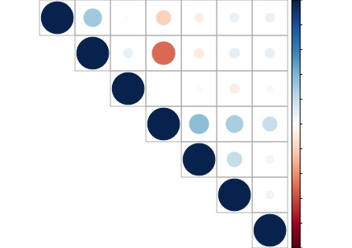
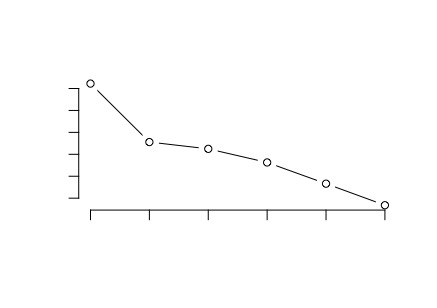
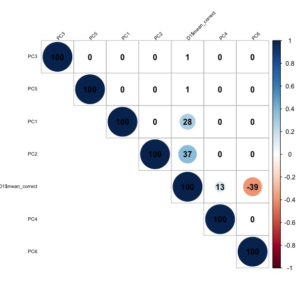

#Data
The data you will be using comes from teh Assistments online intelligent tutoring system (https://www.assistments.org/). It describes students working through online math problems. Each student has the following data associated with them:

- id
- prior_prob_count: How many problems a student has answered in the system prior to this session
- prior_percent_correct: The percentage of problems a student has answered correctly prior to this session
- problems_attempted: The number of problems the student has attempted in the current session
- mean_correct: The average number of correct answers a student made on their first attempt at problems in the current session
- mean_hint: The average number of hints a student asked for in the current session
- mean_attempt: The average number of attempts a student took to answer a problem in the current session
- mean_confidence: The average confidence each student has in their ability to answer the problems in the current session

#Start by uploading the data
```{r}
D1 <- read.table("Assistments-confidence.csv", sep = ",", header = TRUE)

D1 <- dplyr::select(D1, 2:8)

  #We won't need to id variable, so remove that.


```

#Create a correlation matrix of the relationships between the variables, including correlation coefficients for each pair of variables/features.

```{r}
#You can install the corrplot package to plot some pretty correlation matrices (sometimes called correlograms)

library(corrplot)

#Generate pairwise correlations
COR <- cor(D1)

corrplot(COR, order="AOE", method="circle", tl.pos="lt", type="upper",        
tl.col="black", tl.cex=0.6, tl.srt=45, 
        addCoef.col="black", addCoefasPercent = TRUE,
        sig.level=0.50, insig = "blank")

#Study your correlogram image and save it, you will need it later
```
image: 
#Create a new data frame with the mean_correct variables removed

```{r}
D2 <-  dplyr::select(D1, 1:3, 5:7)

#The, scale and center your data for easier interpretation
D2 <- scale(D2, center = TRUE)
```

#Now run the PCA on the new data frame

```{r}
pca <- prcomp(D2, scale = TRUE)
```

#Although the algorithm does not generate the eigenvalues directly for us, we can print a list of the standard deviation of the variance accounted for by each component.

```{r}
pca$sdev

#To convert this into variance accounted for we can square it, these numbers are proportional to the eigenvalue

pca$sdev^2

#A summary of our pca will give us the proportion of variance accounted for by each component

summary(pca)

#We can lot this to get an idea of which components we should keep and which we should drop

plot(pca, type = "lines")
```
image: 
#Think about which components you would drop and make a decision
I would keep the upper left 2 components and drop the others because the combination of upper left 2 components explain the majority of variences. 

```{r}
#Now, create a data frame of the transformed data from your pca.

D3 <- as.data.frame(pca$x)

#Attach the variable "mean_correct" from your original data frame to D3.

D4 <- cbind(D3, as.data.frame(D1$mean_correct))

#Now re-run your scatterplots and correlations between the transformed data and mean_correct. If you had dropped some components would you have lost important infomation about mean_correct?

COR2 <- cor(D4)
corrplot(COR2, order="AOE", method="circle", tl.pos="lt", type="upper",        
         tl.col="black", tl.cex=0.6, tl.srt=45, 
         addCoef.col="black", addCoefasPercent = TRUE,
         sig.level=0.50, insig = "blank")
  
```
image: 

if we drop some components, we would not lose important information. The components with larger eigenvalues contrain the scale and trends information of original data. 

#Now print out the eigenvectors (often called loadings) for the components you generated:

```{r}
pca$rotation

#Examine the eigenvectors, notice that they are a little difficult to interpret. It is much easier to make sense of them if we make them proportional within each component

loadings <- abs(pca$rotation) #abs() will make all eigenvectors positive

sweep(loadings, 2, colSums(loadings), "/") #sweep() computes each row as a proportion of the column. (There must be a way to do this with dplyr()? * group_by () %>% summarise (n=n()) %>% mutate (rel.freq = n / total)*)
```
#Now examine your components and try to come up with substantive descriptions of what some might represent?

From the loadings, we could see component 1 represents 0.63 of meanhint, 0.45 of problem attempts; component 2 represent 0.81 of prior percent correct, 0.45 of prior problem count etc.

#You can generate a biplot to help you, though these can be a bit confusing. They plot the transformed data by the first two components. Therefore, the axes represent the direction of maximum variance. Then mapped onto this point cloud are the original directions of the variables, depicted as red arrows. It is supposed to provide a visualization of which variables "go together". Variables that possibly represent the same underlying construct point in the same direction.  
```{r}
biplot(pca)
```
image: 
image: 

we could see there are 3 components (PCA 1&5&6) almost overlab with each other. Therefore, we could eliminate those 2 components (PCA 5&6) represented least information. 

#Calculate values for each student that represent these your composite variables and then create a new correlogram showing their relationship to mean_correct.
(Not sure if I understand the problem in the right way....) 


```{r}
D10 <- t(D2)
pca2 <- prcomp(D10, scale = TRUE)
pca2$sdev
pca2$sdev^2
summary(pca2)
plot(pca2, type = "lines")
D11 <- as.data.frame(pca2$x)
D12 <- cbind(D11, as.data.frame(D1$mean_correct)) 
# I dont understant how this works, but it works....

COR5 <- cor(D12)
corrplot(COR5, order="AOE", method="circle", tl.pos="lt", type="upper",        
         tl.col="black", tl.cex=0.6, tl.srt=45, 
         addCoef.col="black", addCoefasPercent = TRUE,
         sig.level=0.50, insig = "blank")


```

image: 
```{r}
pca2$rotation

loadings2 <- abs(pca2$rotation)
sweep(loadings2, 2, colSums(loadings2), "/") 

biplot(pca2)
fit <- princomp(D11,cor=TRUE)
biplot(fit)

```
image: 

#Also in this repository is a data set and codebook from Rod Martin, Patricia Puhlik-Doris, Gwen Larsen, Jeanette Gray, Kelly Weir at the University of Western Ontario about people's sense of humor. Can you perform a PCA on this data?

```{r}
P1 <- read.table("humor_data.csv", sep = ",", header = TRUE)

P2 <- dplyr::select(P1, 1:32)

COR6 <- cor(P2)
corrplot(COR6, order="AOE", method="circle", tl.pos="lt", type="upper",        
         tl.col="black", tl.cex=0.6, tl.srt=45, 
         addCoef.col="black", addCoefasPercent = TRUE,
         sig.level=0.50, insig = "blank")
```

image: 
There are some questions are correlated with each others, forming a heatmap-like pattern in the correlation graph.
```{r}
pca3 <- prcomp(P2, scale = TRUE)
pca3$sdev
pca3$sdev^2
summary(pca3)
plot(pca3, type = "lines")


```

image: 
#First 6 PCs explain the majority of variences. we could drop the other components in PCA.
```{r}
pca3$rotation
loadings3 <- abs(pca3$rotation)
sweep(loadings3, 2, colSums(loadings3), "/") 
biplot(pca3)

fit <- princomp(P2,cor=TRUE)
biplot(fit)

```

image: 
Confirmed that we do not need to keep all 32 components because they overlab with each other. We can keep 6 principle components for analysis.
```{r}
P3 <- as.data.frame(pca3$x)
P4 <- dplyr::select(P3, 1:6)

P5 <- cbind(P4, as.data.frame(P1$affiliative))
COR7 <- cor(P5)
corrplot(COR7, order="AOE", method="circle", tl.pos="lt", type="upper",        
         tl.col="black", tl.cex=0.6, tl.srt=45, 
         addCoef.col="black", addCoefasPercent = TRUE,
         sig.level=0.50, insig = "blank")
```

image: 
PC1 is 0.76 negatively correlated to affiliative score.
```{r}
P6 <- cbind(P4, as.data.frame(P1$selfenhancing))
COR8 <- cor(P6)
corrplot(COR8, order="AOE", method="circle", tl.pos="lt", type="upper",        
         tl.col="black", tl.cex=0.6, tl.srt=45, 
         addCoef.col="black", addCoefasPercent = TRUE,
         sig.level=0.50, insig = "blank")
```

image: 
PC1 is 0.69 negatively correlated to selfenhancing score.
```{r}

P7 <- cbind(P4, as.data.frame(P1$agressive))
COR9 <- cor(P7)
corrplot(COR9, order="AOE", method="circle", tl.pos="lt", type="upper",        
         tl.col="black", tl.cex=0.6, tl.srt=45, 
         addCoef.col="black", addCoefasPercent = TRUE,
         sig.level=0.50, insig = "blank")
```

image: 
PC5 is 0.58 positively correlated to aggressive score.
```{r}

P8 <- cbind(P4, as.data.frame(P1$selfdefeating))
COR10 <- cor(P8)
corrplot(COR10, order="AOE", method="circle", tl.pos="lt", type="upper",        
         tl.col="black", tl.cex=0.6, tl.srt=45, 
         addCoef.col="black", addCoefasPercent = TRUE,
         sig.level=0.50, insig = "blank")
```

image: 
PC1 is 0.59 positively correlated to selfdefeating score. PC1 is 0.56 negatively correlated to selfdefeating score.